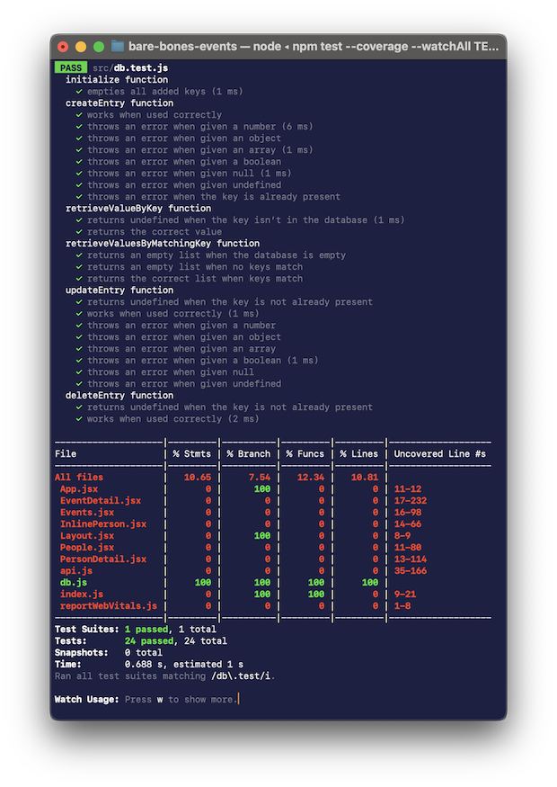

**CMSI 3520** Database Systems, Fall 2022

# Assignment 0921
After being a fiddle-level database user, it’s time to jump to the other side and take a peek at being a database _implementer_. And of all database paradigms that are practical to implement in a short period of time, a _key-value database_ is the best match due to its simplicity and similarity to functionalities that are already present in many programming languages.

## Background Reading
The Elmasri & Navathe text doesn’t quite cover key-value databases, but if you haven’t done so yet, a look or review at Chapters 1 and 2 will help put our sample code in better big-picture context. Our little bare-bones app serves as a microcosm for the layers and architecture described in those chapters.

The [documentation for Redis](https://redis.io/docs/) gives you a more in-depth and concrete sense of a real-world, used-in-production key-value database. Further, [try.redis.io](https://try.redis.io) provides straightforward access to something live and hands-on.

Our little [key-value database introduction](http://dondi.lmu.build/share/db/key-value-databases.pdf) summarizes the core key-value database ideas in a way that focuses more closely on what you need to know for this assignment.

## For Submission: Completed Key-Value Database Codealong
We will seek to do the assignment directly in class—just follow along then turn in your copy. The goal here is to give you a concrete feel for what is involved in implementing a database. _Someone_ has to program these things after all!

The provided code, when completed, is a bottom-to-top event management application, albeit a little bit (well, a _lot_) bare-bones 🦴🦴🦴 Yep, for those of you who’ve been in past classes with me, this is another in my bare-bones™ product line of minimally-functional software 😎

### _Key (ahem)_ Parts to Understand
The web app is implemented in React and is quite rudimentary; but that’s OK because we aren’t focused on the front end here. What you should seek to assimilate are _api.js_ and _db.js_. The interactions across these layers will inform our mini-stack assignments as well as future actual systems that you may encounter in the future:

| Layer/File(s) | Status | Description | Test Suite |
| ------------- | ------ | ----------- | ---------- |
| Front end (React components _*.jsx_ and CSS _*.css_) | Fully-written | Just enough functionality so you can use the finished product | n/a (front-end test suites are hard!…and out of scope for this course) |
| [_api.js_](./src/api.js) | Fully-written | Application-specific information storage functions | [_api.test.js_](./src/api.test.js) |
| [_db.js_](./src/db.js) | Function signatures only—This is the thing to implement! | **_Non_**-application-specific key-value database…can be used for other applications | [_db.test.js_](./src/db.test.js) |

### Commands That are…of _Value (cough)_
Bare-Bones Events 🦴 is a fairly standard React web app; as such, if you need details on any of the following requirements or commands, other sources that you might find on the web should look very similar.

#### Requirements
* A recent-enough version of [Node](https://nodejs.org)
* This will include _npm_, a.k.a. the “Node package manager”

Actually that’s it…if you don’t already have _node_, installation can be done in many ways: [direct download](https://nodejs.org), various package manager(s) (mostly for Linux-based systems), [Homebrew](https://formulae.brew.sh/formula/node), etc. Pick what works best for you.

#### Setup, Startup, & Testing
To prep a fresh clone of this repository for execution, go to its directory via the command line and run:

    npm install

Once that finishes, start the web app with:

    npm start

Note, out of the box you will see errors all over the place—because the database isn’t functional!

To see live progress as your database comes together, run the test suite and keep it running:

    npm test -- --coverage --watchAll

This will also show errors out of the box—the goal is to get as close as possible to 💯% passing tests and 💯% code coverage.

The test suite runner (called [Jest](https://jestjs.io)) is meant to stay running while you code. It monitors changes in your files and re-runs tests as needed, showing test successes and failures. The `--coverage` option provides a _coverage report_ showing how much of your code is reached by the tests.

#### How to “Go Green”
Both _api.js_ and _api.test.js_ are fully written—they are there to give you some examples for how a unit test and its implementation interact. Test failures in _api.test.js_ aren’t due to bugs in _api.js_—they happen because _api.js_ relies upon _db.js_ and it is _that_ module that is incomplete.

Thus, our codealong will tackle the unfinished functions in _db.js_ one by one, and as we go, we hope to see _db.test.js_ pass more and more. Eventually, _api.test.js_ will also pass completely, and when that happens the web app itself will become fully operation. It’s like dominoes 🁽🁱 but standing up rather than tumbling down!

When in this mode, it will be useful to hit <kbd>p</kbd> in Jest. This will put it in “pattern mode,” which makes it focus only on test files whose names match a particular pattern. Typing <kbd>d</kbd> <kbd>b</kbd> <kbd>.</kbd> <kbd>t</kbd> <kbd>Enter</kbd>/<kbd>Return</kbd> will make Jest home in on just _db.test.js_, and will switch to a per-test display:

(that’s how it will look when all of your tests pass, not from a fresh clone)

As mentioned, we will do this in class—it may be rough-and-tumble but it will work. There should be enough time before the due date to give your code a round of refinement and your own personal touch—always a good thing, can’t hurt! Just stay 🟢

#### Quality-of-Life Tips
* `console.log` during tests-in-progress: Some unit tests involve multiple steps and call other database functions that you might not have implemented yet. While in mid-implementation, you can use to `console.log` to display internal values to ensure that things are on the right track
* Make use of [Prettier](https://prettier.io): To make code formatting worry-free, the repository comes with a Prettier configuration file (_.prettierrc_) that has been set up to my, um, opinionated code formatting tastes 🧐 Make use of that file by getting your editor to invoke Prettier every time you save your code—for instructions, look up your editor’s documentation on the web
* Learn about the [_coverage_ folder](https://www.zeljkovic.sh/generating-code-coverage-report-in-jest/) for more detail: The code coverage report that you see on the command line has a richer, more detailed sibling in the autogenerated _coverage_ folder on your local clone. Opening the HTML file within provides more information that you might find useful in reaching 100% coverage

## How to Turn it In
Commit your work to GitHub. At a minimum, it will modify a single file:
* [_db.js_](src/db.js)

But feel free to tinker and refine other things. Extra credit may be given depending on the quality and amount of such tweaks, up to ten (10) additional points—whether and how much is completely at the discretion of the evaluator. The more related these are to database functionality, the better.

## Specific Point Allocations
This assignment is scored according to outcomes _1a_, _1d_, _3c_, _3d_, and _4a_ to _4f_ in the [syllabus](https://dondi.lmu.build/fall2022/cmsi3520/cmsi3520-fall2022-syllabus.pdf). For this particular assignment, graded categories are as follows:

| Category | Points | Outcomes |
| -------- | -----: | -------- |
| Percentage of tests passed | 35 points | _1a_, _1d_, _3c_, _3d_, _4a_ |
| Percentage of coverage reached | 15 points | _1a_, _1d_, _3c_, _3d_, _4a_ |
| More meat to the bones 🍖 (refinements, functionality, refactoring, etc.) | up to 10 extra | _4d_ |
| Hard-to-maintain code | deduction only | _4b_ |
| Hard-to-read code | deduction only | _4c_ |
| Version control | deduction only, if insufficient | _4e_ |
| Punctuality | deduction only, if late | _4f_ |
| **Total** | **50** |

Because our codealong is time-constrained, we will focus on functionality. There will most likely be room for refactoring, consolidation, improvements, etc. Thus, outcomes _4b_ and _4c_ do still apply.
